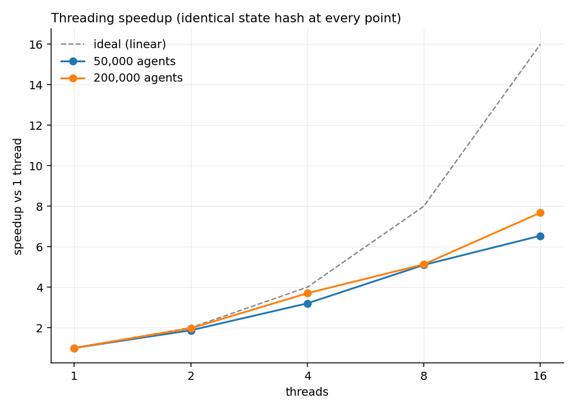
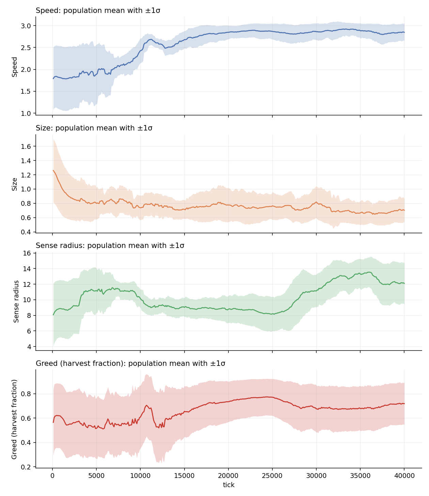
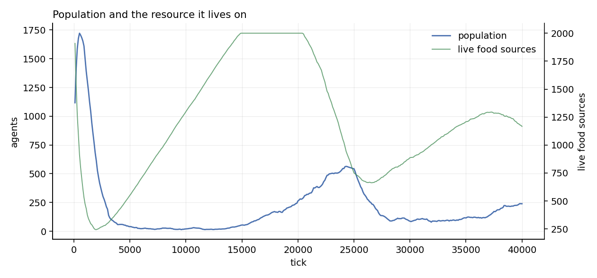
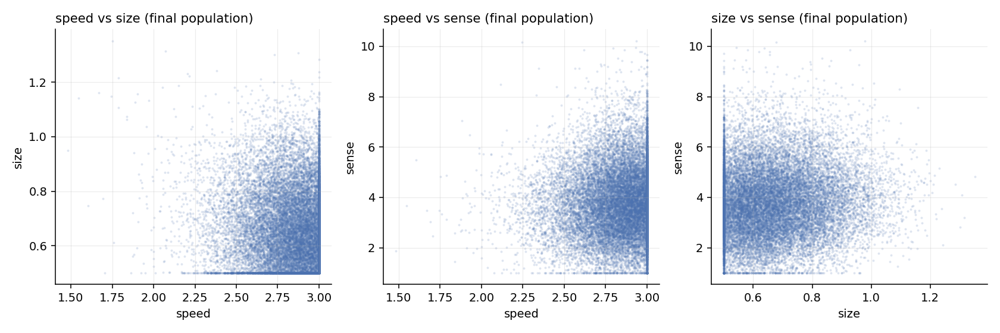

# EvoSim — Deterministic Parallel Evolution Simulator

A fixed-timestep evolution simulator in C++17 that parallelises across cores
**without giving up bit-exact reproducibility**.

> **A 1-thread run and a 16-thread run produce the same 64-bit state hash.**
> Not "close". Not "within tolerance". The same bits — on either neighbour
> search path, at 20k agents, and when oversubscribed to 100 threads on an
> 18-core box.

Agents carry three heritable traits, forage, spend energy, reproduce with
mutation, and die. There is no fitness function: selection falls out of an
energy economy where movement cost is quadratic in speed and cubic in size, so
maxing a trait is fatal rather than free.

The evolution is the demo. The engine is the point.

```bash
cmake -B build && cmake --build build
ctest --test-dir build            # 7 suites, including the invariance proof

# The demo. One invocation runs 1/2/4/8/16 threads and compares state hashes.
./build/evosim --seed 42 --ticks 300 --thread-sweep \
    --set population.initial_agents=200000 --set food.target_count=400000 \
    --set world.width=7071 --set world.height=7071
```

```
| threads | ms/tick | speedup | efficiency | population | state hash |
|---:|---:|---:|---:|---:|---|
| 1 | 39.401 | 1.00x | 100% | 188040 | 9256348aa7c5b45e |
| 2 | 20.043 | 1.97x |  98% | 188040 | 9256348aa7c5b45e |
| 4 | 10.662 | 3.70x |  92% | 188040 | 9256348aa7c5b45e |
| 8 |  7.683 | 5.13x |  64% | 188040 | 9256348aa7c5b45e |
| 16|  5.131 | 7.68x |  48% | 188040 | 9256348aa7c5b45e |

PASS: every thread count produced state hash 9256348aa7c5b45e
```

Run it at the default 1,000 agents and the hashes still match, but the speedup
is *below* 1: a tick there costs ~0.08 ms, which is less than the cost of
dispatching it across 16 threads. The command says so rather than letting the
demo look like it disproves its own headline.

---

## Results

Measured on an Apple M5 Pro (6 performance + 12 efficiency cores, 24 GB),
Apple clang 21, `-O3`, C++17. Every number below was produced by the benchmarks
in `bench/`; none of them are hand-typed.



### Threading scale-up — 200,000 agents

| threads | ms/tick | speedup | parallel efficiency | state hash |
|---:|---:|---:|---:|---|
| 1 | 39.401 | 1.00x | 100% | `9256348aa7c5b45e` |
| 2 | 20.043 | 1.97x | 98% | `9256348aa7c5b45e` |
| 4 | 10.662 | 3.70x | 92% | `9256348aa7c5b45e` |
| 8 | 7.683 | 5.13x | 64% | `9256348aa7c5b45e` |
| 16 | 5.131 | 7.68x | 48% | `9256348aa7c5b45e` |

**All thread counts produced the same state hash.**

### Threading scale-up — 50,000 agents

| threads | ms/tick | speedup | parallel efficiency | state hash |
|---:|---:|---:|---:|---|
| 1 | 8.681 | 1.00x | 100% | `fb244219630a45d7` |
| 2 | 4.645 | 1.87x | 93% | `fb244219630a45d7` |
| 4 | 2.715 | 3.20x | 80% | `fb244219630a45d7` |
| 8 | 1.703 | 5.10x | 64% | `fb244219630a45d7` |
| 16 | 1.327 | 6.54x | 41% | `fb244219630a45d7` |

**All thread counts produced the same state hash.**

### Measured serial fraction

Rather than inferring the serial fraction from the speedup curve, `bench_scaling
--mode serial` times each phase directly.

| phase | parallel? | ms/tick @1 | ms/tick @16 | share @16 |
|---|---|---:|---:|---:|
| P1-P3 grid build (total) | mixed | 1.123 | 0.923 | 17.9% |
| &nbsp;&nbsp;of which P2 prefix sum | **serial** | 0.302 | 0.311 | 6.0% |
| P4 agents | parallel | 36.277 | 3.846 | 74.6% |
| P5 claim resolution | **serial** | 0.024 | 0.030 | 0.6% |
| P6 mark deaths | parallel | 0.100 | 0.067 | 1.3% |
| P7 compact + reproduce | **serial** | 0.115 | 0.118 | 2.3% |
| P8 food respawn | **serial** | 0.169 | 0.169 | 3.3% |
| whole tick | - | 37.808 | 5.153 | 100.0% |

- Serial fraction at 1 thread: **1.6%** (Amdahl ceiling 61.9x)
- Serial fraction at 16 threads: **12.2%** (Amdahl ceiling 8.2x)

The serial fraction is larger at 16 threads because the parallel phases shrink while the serial ones do not -- that is precisely what the ceiling means.

**Reading this honestly:** the measured serial phases are only 1.6% of a
one-thread tick, which puts the Amdahl ceiling at 61.9x — far above the
7.68x actually observed at 16 threads. So Amdahl is *not* what limits this
workload. Two things are:

1. **Core heterogeneity.** This machine has 6 performance cores and 12
   efficiency cores. Parallel efficiency is 98% at 2 threads and 92%
   at 4 — all on P-cores — and then falls to 64% at 8 and 48% at 16
   as the E-cores join. The knee lands exactly where it should if an E-core runs
   at roughly 40% of a P-core. P4 alone, the phase that is actually parallel,
   speeds up 9.4x.
2. **The serial fraction is measured, not fixed.** At 16 threads the parallel
   phases have shrunk by ~10x while the serial ones have not, so the same
   absolute serial work is now 12.2% of the tick. That is what an Amdahl
   ceiling means in practice.

### Neighbour search: naive vs counting-sort grid

| agents | food | world | naive ms/tick | grid ms/tick | speedup |
|---:|---:|---:|---:|---:|---:|
| 100 | 200 | 158^2 | 0.068 | 0.018 | 3.9x |
| 1000 | 2000 | 500^2 | 3.593 | 0.083 | 43.2x |
| 5000 | 10000 | 1118^2 | 106.999 | 0.618 | 173.1x |
| 10000 | 20000 | 1581^2 | 485.253 | 1.373 | 353.4x |
| 25000 | 50000 | 2500^2 | 3282.271 | 4.053 | 809.8x |
| 50000 | 100000 | 3536^2 | 13258.650 | 8.555 | 1549.8x |
| 100000 | 200000 | 5000^2 | - | 18.118 | - |
| 200000 | 400000 | 7071^2 | - | 38.364 | - |
| 400000 | 800000 | 10000^2 | - | 100.507 | - |

Up to **1550x**. Agents sustainable at 60 Hz (16.67 ms/tick) rise
from **2,070** on the naive path to **92,578** on the grid.

### Memory layout: SoA vs AoS

The kernel touches 4 of the 9 per-agent fields (32 of 80 bytes). SoA streams
four dense arrays; AoS strides over the whole struct and pulls the other five
fields into cache for nothing.

| agents | SoA working set (MiB) | AoS working set (MiB) | SoA ns/agent | AoS ns/agent | SoA speedup |
|---:|---:|---:|---:|---:|---:|
| 50000 | 1.53 | 3.81 | 0.474 | 0.785 | 1.66x |
| 500000 | 15.26 | 38.15 | 0.485 | 1.095 | 2.26x |
| 4000000 | 122.07 | 305.18 | 0.486 | 1.277 | 2.63x |

The gap widens with the working set — 1.66x at 50k agents, 2.63x at 4M — which
is the signature of a cache effect rather than an instruction-count one. SoA is
also timed first in each pair, so it pays the cold-cache cost and the numbers
are conservative.

### False sharing: a negative result worth reporting

65536 cache-resident values, swept 96 times per chunk, 20 reductions. This machine reports a 256-byte cache line, so the textbook `alignas(64)` still leaves two slots sharing one coherence granule.

| threads | unpadded ms | alignas(64) ms | alignas(256) ms | fix vs unpadded | shipped (local acc) ms |
|---:|---:|---:|---:|---:|---:|
| 1 | 257.5 | 252.3 | 279.0 | 0.92x | 60.6 |
| 2 | 128.7 | 128.6 | 142.2 | 0.91x | 32.0 |
| 4 | 67.2 | 67.4 | 81.2 | 0.83x | 16.2 |
| 8 | 41.2 | 40.0 | 43.4 | 0.95x | 9.8 |
| 16 | 22.5 | 22.6 | 24.6 | 0.92x | 7.2 |

The last column is what evosim actually ships -- accumulate in a local and store to the slot once per chunk. It sidesteps the problem rather than padding around it, and beats every padded variant.

**This is the benchmark that did not reproduce, and that is the finding.** The
textbook expectation is a dramatic graph. On this hardware padding is not merely
neutral, it is very slightly *counterproductive* — 0.83–0.95x at every
thread count — because spreading 64 slots across 16 KB costs more in cache
footprint than the coherence traffic it avoids.

Getting to a trustworthy null took three attempts, and the two failed ones are
instructive:

1. **A million values per reduction measured nothing** — at 8 MB per pass the
   loop is memory-bandwidth bound, and streaming that much data swamps any
   coherence traffic. False sharing is a store-traffic effect; the loads have to
   be cheap first.
2. **Even cache-resident, `slot.value += v[i]` measured nothing** — the
   optimiser hoists the accumulator into a register, leaving one store per
   chunk. The tell was 0.5 ns/add, about two cycles, which is FP-add latency and
   far too fast for a load-add-store round trip to memory. A `volatile`
   accumulator forces the store to land.
3. **`alignas(64)` is the wrong constant here.** This machine reports a 128-byte
   cache line (and libc++ reports `hardware_destructive_interference_size` as
   256), so the textbook 64-byte padding leaves two slots inside one coherence
   granule and buys literally nothing. `reduction.hpp` now derives its alignment
   from `std::hardware_destructive_interference_size` where available.

With all three fixed, a direct probe — N threads each hammering one `double` —
still shows only ~17% at 16 threads and ~0% at 2–4, where the same probe on x86
typically shows 5–20x. The plausible explanation is the shared cluster L2:
a store to a line owned by a sibling core is serviced locally rather than by a
cross-die coherence round trip.

The shipped reduction sidesteps the question entirely by accumulating into a
local and storing to the slot once per chunk, which is faster than every padded
variant in the table. The padding is kept because it is the right
defensive choice on hardware where false sharing *is* expensive (x86, 64-byte
lines) and because the shipped path stores to each slot once, where the extra
footprint costs nothing — not because it was measured to help here.

---
## Why parallel determinism is hard

Threading breaks reproducibility in four distinct ways, and each needs its own
fix. Naming all four is most of what this project is for.

| Failure | Cause | Fix here |
|---|---|---|
| **Float reduction order** | `a+b+c` ≠ `c+b+a` in floating point, and thread completion order varies between runs | Per-chunk partial sums combined serially in chunk order ([`reduction.hpp`](include/evosim/reduction.hpp)) |
| **Shared RNG** | Threads drawing from one generator consume it in a different order each run | Counter-based stateless RNG keyed on `(seed, agent, tick, purpose)` ([`rng.hpp`](include/evosim/rng.hpp)) |
| **Contended writes** | Two agents reach the same food; the winner depends on scheduling | Claim-and-resolve: collect in parallel, award serially to the lowest agent index ([`world.cpp`](src/world.cpp)) |
| **Read/write interleaving** | Agent *i* reads agent *j*'s half-updated state | Double buffering — read `front_`, write `back_`, swap at tick end |

The insight worth stating out loud: determinism here comes from **disjoint,
index-stable writes and stateless RNG**, not from how the work is partitioned.
Work-stealing would be just as deterministic under this design. Fixed
partitioning is chosen for reproducible *benchmarks*, not for correctness — and
`test_thread_invariance` proves it by oversubscribing to 100 threads on an
18-core machine, which scrambles the scheduling and changes nothing.

### The one that isn't in the textbook: partition count, not thread count

A correct per-thread reduction still fails the cross-thread-count test. Four
threads make four partial sums, sixteen make sixteen, and the two totals differ
in the last bits. So work is always split into a **fixed 64 chunks** regardless
of thread count, and every per-chunk output — partial sums, claim buffers,
neighbour-candidate scratch — is indexed by *chunk*, never by thread id.

`test_reduction` asserts the fix works *and* asserts that the naive per-thread
scheme genuinely disagrees with itself at 4 vs 16 threads, so the test cannot
quietly rot into passing for the wrong reason.

## Architecture

### Fixed timestep

```cpp
constexpr double DT = 1.0 / 60.0;
void run_headless(World& w, uint64_t ticks) {
    for (uint64_t i = 0; i < ticks; ++i) w.step(DT);   // no clock at all
}
```

Variable `dt` makes results frame-rate dependent, so a fast machine and a slow
machine diverge. Fixing the timestep decouples simulation correctness from
rendering performance and is a precondition for reproducibility.

### Phase structure

Fixed order. Changing it means bumping `World::kStateHashVersion`.

```
World::step(dt):
  P1  [PARALLEL] cell index per food item
  P2  [SERIAL]   prefix sum over cell counts -> bucket offsets
  P3  [PARALLEL] scatter indices into the flat sorted array
  P4  [PARALLEL] per agent: sense -> steer -> integrate -> energy -> age,
                 reads front_, writes back_, records claims per chunk
  P5  [SERIAL]   resolve food claims in agent-index order
  P6  [PARALLEL] mark deaths (energy <= 0 or age > MAX_AGE)
  P7  [SERIAL]   stable compaction; append mutated offspring
  P8  [SERIAL]   respawn food to target density
  P9  [PARALLEL] telemetry partial sums -> [SERIAL] fixed-order reduction
  swap(front_, back_); ++tick
```

P7 compaction **preserves relative order**. Swap-and-pop would reorder agents
and diverge two otherwise identical runs.

### Counting-sort spatial grid

Three flat arrays — `cell_of`, `cell_starts`, `sorted` — filled by counting
sort. Not a vector-of-vectors: that can't be filled in parallel
deterministically and scatters the candidate list across the heap. Within a
cell, items land in ascending index order no matter how the build is
partitioned, so **the built grid is identical at any thread count for free**.

The grid indexes *food*, not agents: its cell size is defined as the largest
query radius in the population, and what agents query for is food. Since
`sense_radius` is heritable, the cell size is recomputed every tick.

The naive O(agents × food) scan is kept permanently behind `--naive`. It is the
benchmark baseline and the correctness oracle — `test_spatial_grid` runs both
paths of the full simulation for 400 ticks and asserts the agent arrays stay
bit-identical.

## Things that broke

The three bugs that cost real time, and how each was found.

### 1. Debug and release disagreed on the state hash — because of `sin`

M5's debug-vs-release check failed at the very first sample. Dumping the full
state instead of the hash showed the simulation state was identical everywhere
except `vel_y` on **4 agents out of 1000**, off by one ULP, with `vel_x` fine.

`vel_x` is `cos`, `vel_y` is `sin`. At `-O3` clang recognises an adjacent
`sin(x)`/`cos(x)` pair on the same argument and rewrites it into Apple libm's
`__sincos_stret`, whose sine differs from `sin()` by one ULP on some inputs. No
compiler flag prevents this — `-ffp-contract=off` and `-fno-fast-math` were
already on and are not what's being violated. The call itself has to go.

A first attempt to confirm the theory with a four-sample micro-benchmark
*passed*, which nearly sent me down the wrong path. Four samples out of a
thousand differ; four samples was not enough to hit one.

So [`math.hpp`](include/evosim/math.hpp) implements `sin`, `cos` and `log`
directly (Cody–Waite reduction with fdlibm kernels; `frexp` plus an atanh
series for log). These are plain sequences of IEEE multiplies and adds — without
fast-math the compiler may not reassociate them, and without contraction it may
not fuse them, so they are identical at every optimisation level. As a bonus the
spec didn't ask for, that also makes hashes comparable across platforms, which a
libm-based hash never could be. `sqrt` stays: IEEE-754 requires it to be
correctly rounded, so it is already exact everywhere.

### 2. The grid and the naive scan disagreed on ties

`test_spatial_grid` caught the grid returning a different food item than brute
force, rarely. The naive scan walks food in ascending index order and takes
`d2 < best`, so equidistant food resolves to the lower index for free. The grid
visits candidates cell-block by cell-block, so its candidate list is *not* in
global index order and the same comparison picks whichever tied item it saw
first. Two implementations of "nearest" that agree on distance and disagree on
ties are two different simulations. `nearest_food_grid` now breaks ties on the
food index explicitly.

### 3. A config parser bug hidden by a default value

`config/default.toml` writes `[world]  width = 500.0 ; height = 500.0` — a
section header and a key on the same line. The parser consumed the header and
`continue`d, silently dropping `width`. The first version of the test asserted
`width == 500.0` and passed, because the dropped value was *identical to the
default*. It only surfaced when a malformed-input test expected
`[world] width = wide` to throw and it didn't. The test now uses `501.5`, a
value no default could supply.

The general lesson, and the reason it is worth writing down: a test that asserts
a value equal to the default cannot distinguish "parsed correctly" from "never
parsed at all".

## Building

Requires CMake ≥ 3.16 and a C++17 compiler. No third-party dependencies — the
TOML subset parser and the test harness are both in-tree.

```bash
cmake -B build -DCMAKE_BUILD_TYPE=Release
cmake --build build -j
ctest --test-dir build --output-on-failure
```

The simulation never includes or links a graphics library; `src/` and
`include/` build and run headless on a box with no display.

### Reproducing the debug-vs-release claim

```bash
cmake -B build-debug -DCMAKE_BUILD_TYPE=Debug && cmake --build build-debug -j
./build/test_determinism       --hash-out /tmp/release.txt
./build-debug/test_determinism --hash-out /tmp/debug.txt
diff /tmp/release.txt /tmp/debug.txt && echo "identical"
```

There is deliberately no hardcoded golden hash in the test suite. The claim is
reproducibility on a machine and across builds; a baked-in constant would make
the test fail on any platform whose `sqrt` rounding or `double` layout differs,
which is a different claim than the one being made.

## Usage

```bash
evosim --seed 42 --ticks 100000 --headless --threads 8 --out run.csv
evosim --seed 42 --ticks 10000 --naive --bench
evosim --seed 42 --ticks 10000 --verify           # hash every 1000 ticks
evosim --seed 42 --ticks 10000 --thread-sweep     # 1,2,4,8,16; compares hashes
evosim --set population.initial_agents=200000 --set world.width=7071 ...
```

## Tests

| Test | What it pins down |
|---|---|
| `test_thread_invariance` | **The claim.** 1/2/4/8/16 threads, 5000 ticks, one hash. Plus 20k agents, the naive path, repeated 16-thread runs, and 31/64/100-thread oversubscription. |
| `test_determinism` | Same seed twice; five seeds; naive vs grid; two worlds stepped alternately against a third stepped alone (catches static mutable state). |
| `test_reduction` | Bit-identical sums at 1/2/3/4/7/8/16 threads, and proof the per-thread scheme really does differ. |
| `test_spatial_grid` | Grid vs brute force over 9 configurations including degenerate grids; parallel vs serial build on a dense set; 400 ticks of both full simulation paths. |
| `test_math` | The in-house `sin`/`cos`/`log` against libm, and that `unit_open()`'s smallest output still logs finitely. |
| `test_rng` | Purity, seekability, collision-freedom, uniformity, gaussian moments. |
| `test_config` | The shipped grammar, malformed input, and the default-masking trap from bug 3. |

## What evolves

At the shipped configuration the population settles into a food-limited
equilibrium around 22,000 agents from 1,000 founders, and the traits move under
selection rather than saturating:



- **Speed** rises to ~2.83 of a 3.0 maximum. With food abundant in space but
  hard to find, getting there first pays.
- **Size** collapses to ~0.67 of a 2.0 maximum. Movement cost is cubic in size
  and the only thing size buys is a slightly larger eating radius, which is
  nearly worthless once an agent can home in precisely.
- **Sense radius** is the interesting one. It rises early while the population
  is sparse, peaks, then falls back to ~3.8 out of 15 as the population reaches
  equilibrium: once there are 22,000 agents competing, food is close by anyway
  and paying a linear energy cost to see further stops being worth it. That
  reversal is stabilising selection on a heritable trait, produced by the
  energy economy with no fitness function anywhere in the code.




### Tuning the energy economy

```
cost_per_second = base_cost + move_coef * speed² * size³ + sense_coef * sense_radius
```

The superlinear terms are the whole selection mechanism: with a linear cost
every trait saturates at its maximum and nothing evolves.

The spec's starting values (0.05 / 0.02 / 0.01) are per-*tick* costs. Applied as
a per-second rate at a 60 Hz timestep they are about 30x too cheap: mean energy
climbs monotonically, nothing starves, and the population grows until it hits
`max_agents`. The shipped values (1.00 / 0.35 / 0.15) put a mid-range agent at
~4.3 energy/s against a measured intake of ~6/s, so starvation is a live
pressure, while an agent at maximum traits burns 28.5/s and cannot survive at
all. Energy is applied as `energy -= cost * dt`, so the model stays correct if
the timestep is ever changed.

## What I would do differently

- **The grid is rebuilt from scratch every tick.** Most food does not move
  between ticks, so an incremental update would skip most of the work. The full
  rebuild was chosen because it is trivially deterministic; an incremental one
  would need care to keep bucket order index-stable.
- **Cell size is a single global number** derived from the largest sense radius
  in the population, while sense radius evolves per-agent. One long-sighted
  outlier inflates every cell. A two-level grid, or clamping the cell size to a
  high percentile and handling the tail separately, would fix it.
- **P7 compaction is serial**, at 2.3% of a 16-thread tick. A parallel stream compaction (per-chunk survivor
  counts, prefix sum, parallel scatter) would work, and it is the same shape as
  the counting sort already in `spatial_grid.cpp`.
- **P2's prefix sum is 6.0% of a 16-thread tick** and grows with cell count, so
  it is now the biggest serial term. A parallel scan would help more than
  anything else on this list.
- **The per-chunk histogram for the parallel scatter costs `chunks * n_cells`**,
  so the build only takes that path on dense grids and falls back to a serial
  scatter at this simulation's food density. A blocked or sparse histogram would
  let the parallel path apply generally.

## Résumé summary

Every bracketed value in the spec's template has been replaced with a measured
one, and one bullet was replaced outright: the spec proposed claiming a
false-sharing improvement, which this hardware does not support (see above).

> **EvoSim — Deterministic Parallel Evolution Simulator** | C++17, CMake, Python
>
> - Built a fixed-timestep simulation engine producing bit-identical state
>   hashes across runs, build configurations, **and thread counts**, using
>   counter-based stateless RNG and fixed-order reductions over a thread-count-
>   independent chunk decomposition to eliminate scheduling-dependent results.
> - Parallelised the simulation step across a hand-rolled thread pool and
>   reusable barrier, reaching **7.68x at 16 threads on 200,000 agents**
>   (39.401 → 5.131 ms/tick) with a directly measured serial fraction of
>   1.6%, and identified core heterogeneity rather than Amdahl as the
>   binding constraint.
> - Implemented a counting-sort spatial grid for neighbour queries, cutting
>   per-tick proximity checks from O(n²) to near-linear — **1550x**
>   at 50,000 agents — and raising the agent count sustainable at 60 Hz from
>   2,070 to 92,578.
> - Traced a debug-vs-release hash divergence to clang fusing `sin`/`cos` into
>   `__sincos_stret` at `-O3`, and replaced libm's transcendentals with
>   in-house implementations, making output reproducible across optimisation
>   levels and platforms.

## Layout

```
include/evosim/   rng, math, thread_pool, reduction, world, spatial_grid,
                  genome, telemetry, config, hash
src/              implementations + main.cpp
bench/            bench_neighbors.cpp, bench_scaling.cpp
tests/            7 CTest executables, no third-party framework
analysis/         plot_run.py and the committed plots
config/           default.toml
```

`src/` and `include/` never reference a renderer. The simulation builds and runs
with no graphics library present.
